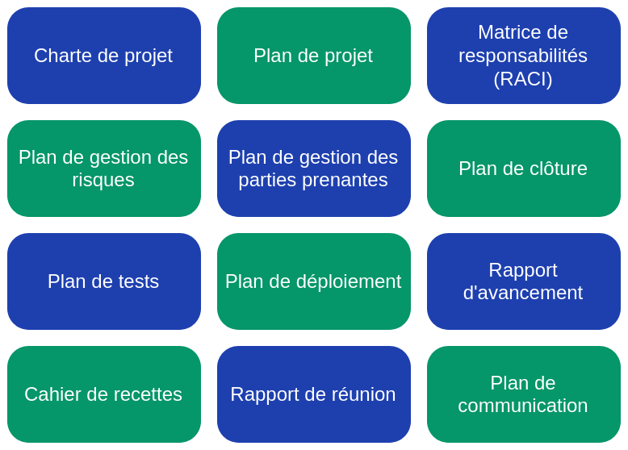
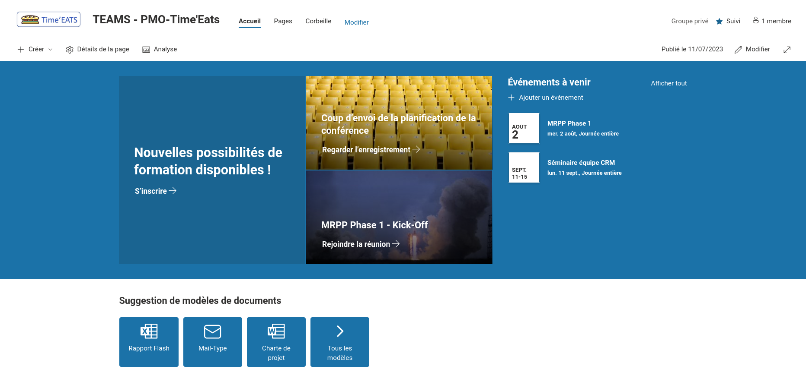
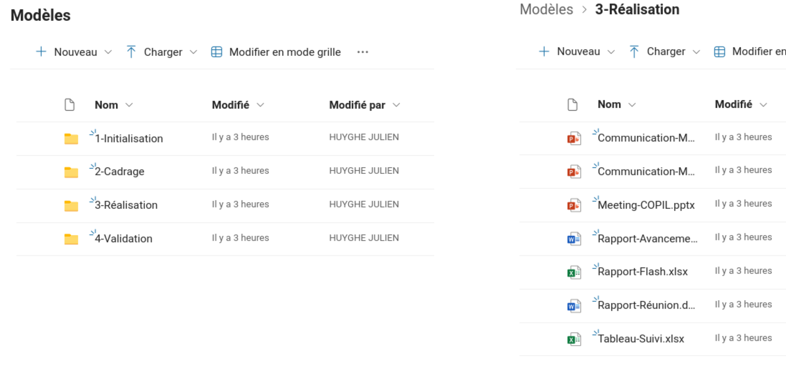
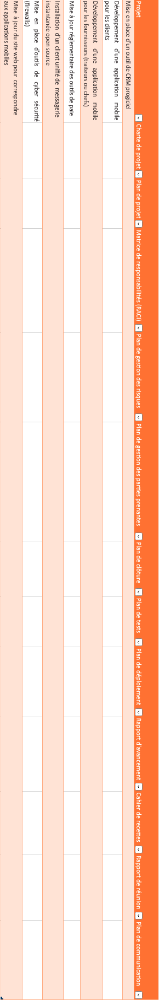

\newpage  

#   Référentiel documentaire

Le rôle de la cellule PMO est de fournir un ensemble de standards, bonne pratiques, ainsi qu'une expertise concernant la gestion d'un projet. Celle-ci peut notamment être amenée à produire des modèles de documents, sur lesquels les chefs de projets peuvent se baser pour créer différents documents liés à leurs projets. Cela permet d'assurer une certaine uniformité à l'ensemble des projets de l'entreprise, et permet un gain de temps, les chefs de projets n'ayant pas à réinventer la roue à chaque projet.

##  Documents référencés

Avant de produire ces différents documents, il nous faut tout d'abord en établir une liste. Parmi eux, on peut citer :

{width=50%}

En quelques mots, voici la nature de ces documents :

 -  **Charte de projet** : La charte de projet (ou note de cadrage), est un document formet permettant de définir certains aspects critiques d'un projet, comme les objectifs, le périmètre, le budget, les parties prenantes ou encore les livrables attendus. Il peut être révisé au cours du temps sur accord de tout le monde. 
 -  **Plan de projet** : Ce document sert à structurer la planification en vue du cadrage du projet, avec la définition des tâches, leurs dépendances, les ressources, les échéances ainsi que les jalons. 
 -  **Matrice de responsabilités** : Couramment appelé "*RACI*"[^3], il permet de clarifier les rôles et les attendus des membres d'un projet en définissant leurs responsabilitées concernant les tâches. 
 -  **Plan de gestion des risques** : Puisque les imprévus, les problèmes et les difficultées font partie de la vie d'un projet, on chercher à minimiser les risques qui pourraient faire que notre projet aboutisse partiellement ou pas du tout. Ce document préciser la manière dont les risques sont identifiés, analysés et évalués, et apporte des solutions permettant de répondre aux risques.
 -  **Plan de gestion des parties prenantes** : Aussi appelé *Plan d'Engagement des Parties Prenantes*, il sert à présenter les niveaux d'implication, d'engagement et d'influence des parties prenantes internes et / ou externes du projet, ainsi que la stratégie de communication mise en place entre-elles. 
 -  **Plan de clôture** : Ce document est assez informel ; il sert à décrire les actions à entreprendre une fois que le projet est livré au client. Est-ce que celui-ci est transmis à une autre équipe qui en assurera la maintenance ? Quelles sont les éventuelles prochaines étapes ? Quelle est son organisation, sa documentation ? etc. 
 -  **Plan de test** : Afin de s'assurer qu'un livrable (intermédiaire ou final) correspond bien au niveau de qualité demandé, il convient de le tester. Un plan de test définit ce que l'on va tester, comment on va le tester, et ce qu'il ne va pas être testé. Idéalement, il vient avec une analyse des risques permettant de décrire les limites de ces choix, et leurs impacts sur la qualité.
 -  **Plan de déploiement** : Déployer signifie introduire une nouvelle solution ou service dans une organisation de manière coordonnée. On va donc chercher à planifier ce déploiement, en utilisant des ressources spécifiques, les moyens de surveillance ainsi que de communication avec les utilisateurs impactés.
 -  **Rapport d'avancement** : Un rapport d'avancement de projet est une mise à jour régulière sur la progression d'un projet. Il présente des informations générales de manière concise afin que les membres d'une équipe puissent rapidement savoir ce qu'il se passe au sein du projet. Il permet ainsi de coordonner les différentes parties prenantes du projet.
 -  **Cahier de recettes** : Le cahier de recettes permet de s'assurer que le résultat d'un projet correspond bien à ce qui était attendu. Il décrit notamment divers processus à réaliser pour garantir la conformité de celui-ci, avec ce qui était spécifié dans la note de cadrage. 
 -  **Rapport de réunion** : Après chaque réunion ayant lieu à des prises de décision, on utilise un rapport de réunion permettant de formaliser ce qui a été énoncé. Cela permet d'assurer une tracabilité du projet, mais également de coordonner les différentes parties prenantes du projet.
 -  **Plan de communication** : Un plan de communication regroupe l'ensemble des actions de communication internet et / ou externe mises en place, afin de promouvoir un produit, des actions réalisées, des événements, ou même la marque auprès de potentiels clients.

[^3]: *RACI* est un acronyme de différents rôles : *Responsable*, *Approbateur*, *Consulté* et *Informé*.  

\pagebreak

##  Base documentaire

Toujours dans une optique d'uniformisation, on va chercher à centraliser tous les documents utiles aux projets. Cela permet d'assurer une tracabilité tout en améliorant les communications. Il existe de nombreuses solutions de *Gestion Électronique des Documents* (GED) disponibles sur le marché ; celles-ci disposent de fonctionnalité comme de la modification collaborative, un système de gestion des droits et accès, un système de gestion de version ou encore des intégrations avec des logiciels tiers. On va également voir par la suite que certaines solutions vont plus loin que de l'archivage de documents, en créant tout un éco-système autour des projets, ce qui améliore encore la communication et la transparence entre les équipes.  

Parmi quelques solutions que l'on peut citer, on retrouve :

|                      	| Intégrations 	| Coûts 	| Infrastructure    	| Collaboration 	|
|----------------------	|--------------	|-------	|-------------------	|---------------	|
| Microsoft SharePoint 	| 4            	| 2     	| SaaS              	| 4             	|
| Atlassian Confluence 	| 3            	| 3     	| On-Premise / SaaS 	| 3             	|
| Alfresco             	| 3            	| N/A     	| PaaS              	| 2             	|
| Nuxeo                	| 4            	| N/A     	| On-Premise / Saas 	| 2             	|
| Bitrix24             	| 2            	| 4     	| SaaS              	| 1             	|
Table: Comparatif de différentes solutions de GED

 -  **Microsoft SharePoint** : Solution populaire, elle a l'avantage d'être intégrée à la suite *Office 365*. Ainsi, il n'y a pas de licence supplémentaire à se procurer si l'on dispose déjà de cette suite, et par conséquent l'intégration avec les autres applications est excellente. En plus de la GED, on retrouve des options pour créer du contenu à l'instar d'une solution *ECM* [^5], ce qui nous permet de centraliser tout un tas d'information et former un hub pour le projet. Cependant, les données sont hebergées sur les data-centers de *Microsoft*.
 -  **Atlassian Confluence** : Solution également très populaire, elle propose des tas de modèles permettant de gagner du temps, et s'intègre très bien avec d'autres produits *Atlassian* tel que *JIRA*, mais aussi les outils *Microsoft*. Moins cher que ses concurrents, elle dispose d'outils permettant la collaboration en temps réel, ainsi que la possibilité d'être hebergée sur un cloud, ou un serveur interne.
 -  **Alfresco** : Alfresco propose un tas d'outils permettant de créer et gérer une base documentaire, comme un système avancé de processus automatisés. Utilisant un système hybride pour stocker ses données, elle ne permet cependant pas un travail simultané entre des équipes. De plus, elle ne publie pas ses tarifs.
 -  **Nuxeo** : Comme Alfresco, Nuxeo est principalement destinée aux grandes entreprises. À l'instar de SharePoint, Nuxeo propose des fonctionnalités pour se créer un hub autour des projets. Elle a également l'avantage d'être utilisable à la fois sur un serveur interne, ou un cloud. Cependant, elle ne propose que peu de solutions de collaboration.
 -  **Bitrix24** : Solution encore jeune, elle propose moins d'outils que les précédentes, mais dispose de tout le nécessaire pour une gestion des documents efficace. Elle dispose d'une grille tarifaire très avantageuse et est plutôt destinée à des petites et moyennes entreprises.

De ces solutions, il n'y en a pas vraiment une qui se dégage du lot. Chacune dispose d'avantages et inconvénients, et les choix vont surtout être faits en fonction de différents critères. Pour notre cas, nous avons opté pour *Microsoft SharePoint*. Étant assez ergonomique et inclu avec *Office 365*, elle propose des outils efficaces pour des projets de toutes tailles.

### Création d'une base documentaire avec Microsoft SharePoint

Comme vu précédemment, la force de *Microsoft SharePoint* est sa capacité à créer un hub pour centraliser différentes équipes. On dispose de contrôles d'accès afin de limiter les vues d'utilisateurs non-désirés, comme des externes au projets. Les différentes options permettent d'obtenir un système personnalisé et ergonomique, qui contribue à améliorer la transparence au sein des projets, ainsi que favoriser les échanges entre équipes.

{width=100%}

### Arborescence

En terme d'arborescence, on propose une base plutôt épuré par défaut. On retrouve quatre phases qui pourraient correspondre aux habituelles quatre ou cinq phases d'un projet. Une première d'initialisation, qui correspond à une étude avant-projet, suivi d'un phase de cadrage contenant des plans (de communication, de projet, etc.), une phase de réalisation puis de validation. 
Au sein de ces répertoires, on trouve les différents modèles de documents utiles aux chefs de projets dans leurs activitées.

\pagebreak  

##  Tableau des différents projets et modèles de documents

Dans un soucis de clarté, et dans la mesure où chaque livrable devra être produit pour chaque projet du programme, il est intéressant de réaliser un tableau à deux dimensions entre les projets et les livrables. Cela permettra d'avoir une meilleure vue d'ensemble des projets.

{height=80%}

[^5]: *ECM* - *Entreprise Content Management*