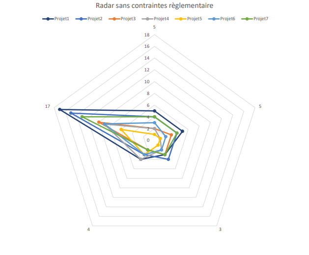
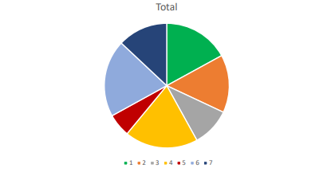
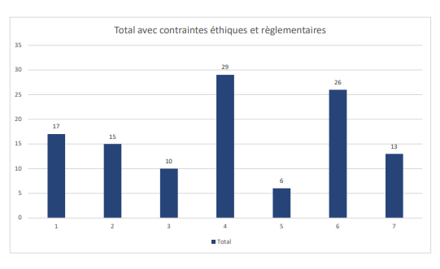
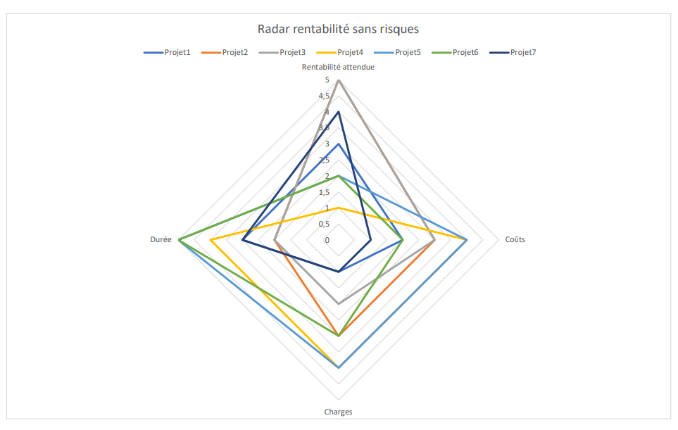
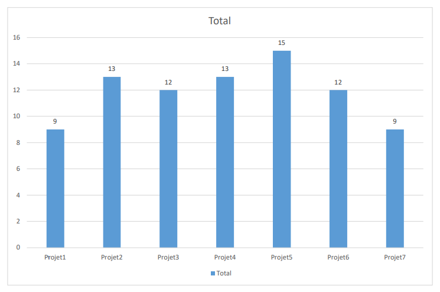
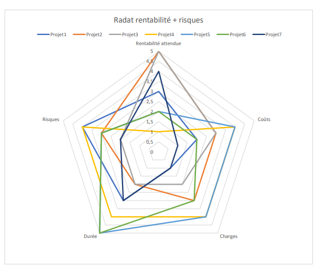
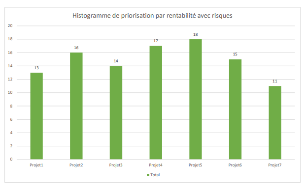


\newpage

#   Priorisation des projets

## Présentation de la stratégie de l'entreprise  

Les principaux objectifs de *Time’EATS* sont de diversifier ses services en proposant de la vente à domicile et de développer son réseau de chefs et traiteurs pour une collaboration durable avec une empreinte forte de la marque à la fois pour les particuliers et les professionnels. 
 
Les projets en cours et à venir doivent ainsi permettre de récupérer 1 million de nouveaux clients d’ici 2 ans, dont plus de 10 000 professionnels, et devenir un acteur incontournable de la restauration de service en atteignant une part de marché de 25%  d’ici 5 ans. 
 
Time’EATS tient cependant à respecter les valeurs auxquelles elle croit depuis sa création en mettant en avant la qualité des produits, le *made in France* avec des fournisseurs de proximité et une empreinte environnementale la plus faible possible. C’est pourquoi Time’EATS ne se présente en aucun cas comme le futur concurrent direct des grandes marques internationales de livraison de produits de restauration, mais comme une marque authentique, responsable et avec des valeurs fortes au service de ses clients.

## Méthodologie de priorisation par stratégie

Afin d’atteindre les objectifs fixés par l’entreprise, nous avons mis en place une méthodologie de priorisation des projets répondant à la vision stratégique du groupe. 
Les critères de priorisation choisis méthodiquement sont les indicateurs de mesure des différents points stratégiques que nous devons respecter. 
 
Ainsi, après la prise de connaissance du portefeuille de projets choisis par la DSI, nous avons soigneusement recueilli et classé les informations par projet comme suit :

\pagebreak

| Nom 	| Début 	| Budget 	| Durée 	| Charge estimée (j/h) 	| Nécessité /5 	| Rentabilité /5 	| Maîtrise du risque /5 	|
|---	|---	|---	|---	|---	|---	|---	|---	|
| MeP outil CRM 	| Mars 	| 250K 	| 6 Mois 	| 300 	| 5 	| 3 	| 4 	|
| Dév. mobile clients 	| Février 	| 150K 	| 8 Mois 	| 200 	| 5 	| 5 	| 3 	|
| Dév. mobile fournisseur 	| Février 	| 200K 	| 8 Mois 	| 250 	| 5 	| 5 	| 2 	|
| MàJ outil de paie 	| Juin 	| 50K 	| 3 Mois 	| 50 	| 5 	| 1 	| 4 	|
| Installation client de messagerie 	| Avril 	| 50K 	| 2 Mois 	| 50 	| 2 	| 2 	| 3 	|
| MeP outil de cybersécurité 	| Janvier 	| 250K 	| 2 Mois 	| 220 	| 5 	| 2 	| 3 	|
| Maj site web 	| Février 	| 300K 	| 3 Mois 	| 400 	| 5 	| 4 	| 2 	|
Table: Présentation des projets. [^4]

[^4]: MeP - Mise en Place ; MàJ - Mise à jour ; Dev. - Développement

Puis, d’après les informations dont nous disposions et en nous appuyant sur la vision de l’entreprise, nous avons dégagé des indicateurs mesurables de points stratégiques.  
Ainsi, nous avons sélectionné pour chaque projet :

 -  La valeur ajoutée pour les clients
 -  L'avantage concurrentiel
 -  La contribution à la croissance de l'entreprise
 -  Le niveau de maîtrise des risques

\pagebreak

Grâce à ces critères, une première grille de priorisation a pu être mise en place :

|  	| Projet1 	| Projet2 	| Projet3 	| Projet4 	| Projet5 	| Projet6 	| Projet7 	|
|---	|:---:	|:---:	|:---:	|:---:	|:---:	|:---:	|:---:	|
| Valeur ajoutée client 	| 5 	| 4 	| 2 	| 2 	| 1 	| 3 	| 4 	|
| Avantage concurrentiel 	| 5 	| 4 	| 3 	| 1 	| 1 	| 2 	| 4 	|
| Contribution croissance 	| 3 	| 4 	| 3 	| 2 	| 1 	| 2 	| 3 	|
| Niveau de maîtrise des risques 	| 4 	| 3 	| 2 	| 4 	| 3 	| 3 	| 2 	|
| **Total** 	| **17** 	| **15** 	| **10** 	| **9** 	| **6** 	| **9** 	| **13** 	|
Table: Priorisation stratégique sans contraintes.

### Diagramme radar

Afin de représenter la valeur des indicateurs stratégiques pour chaque projet, nous avons utilisé des diagrammes radars. Ceux-ci permettent de visualiser rapidement les projets qui couvrent le spectre le plus large possible de ces points stratégiques pour formaliser la priorisation.  

{width=75%}

Cette première modélisation radar nous a permis d’extraire une première grille de priorisation :  

 1. **Mise en place d'un outil CRM**
 2. **Développement mobile pour les clients**
 3. **Mise à jour du site web**
 4. **Développement  mobile pour les fournisseurs**
 5. Ex Aequo : **Mise à jour outil de paie** et **mise en place d’un outil de cybersécurité**
 6. **Installation d’un client de messagerie instantanée**

Ainsi, nous avons pu dégager une priorisation de notre portefeuille dans le cadre d’un respect des points stratégiques de l’entreprise. Cependant, à ce stade, nous avions deux projets à égalité parfaite en termes de points stratégiques et certains facteurs de comparaison semblaient manquer à l’appel pour déterminer la priorisation la plus complète possible.  

##  Prise en compte des contraintes pour la priorisation  

Dans la gestion de portefeuille, les indicateurs stratégiques ou de rentabilité ne suffisent pas pour émettre une proposition de priorisation. 
En effet, afin d’obtenir une grille de priorisation plus réaliste et complète, nous avons également pris en compte les contraintes inhérentes aux obligations et valeurs de l’entreprise.  

### Contraintes règlementaires  

Certains projets comportent des obligations règlementaires qui doivent absolument entrer en ligne de compte dans la priorisation.  
Les projets 4 de mise à jour règlementaire des outils de paie 6 de mise en place d’un outil de cybersécurité comportent ce type d’obligation.  

Ces contraintes règlementaires ont été pondérées afin de rééquilibrer notre grille de priorisation.  
Ainsi, en multipliant ces critères règlementaires par 2, nous obtenons une nouvelle priorisation du portefeuille de projets :  

 1. **Mise en place d’un outil de cybersécurité**
 2. **Mise à jour des outils de paie**
 3. **Mise en place d’un outil CRM**
 4. **Développement mobile pour les clients**
 5. **Mise à jour du site web**
 6. **Développement mobile pour les fournisseurs**
 7. **Installation d’un client de messagerie instantanée**

|  	| Projet1 	| Projet2 	| Projet3 	| Projet4 	| Projet5 	| Projet6 	| Projet7 	|
|---	|:---:	|:---:	|:---:	|:---:	|:---:	|:---:	|:---:	|
| Valeur ajoutée client 	| 5 	| 5 	| 2 	| 2 	| 1 	| 3 	| 4 	|
| Avantage concurrentiel 	| 4 	| 3 	| 3 	| 1 	| 1 	| 2 	| 4 	|
| Contribution croissance 	| 4 	| 4 	| 3 	| 2 	| 1 	| 2 	| 3 	|
| Niveau de maîtrise des risques 	| 4 	| 3 	| 2 	| 4 	| 3 	| 3 	| 2 	|
| Contraintes règlementaires *2 	| 0 	| 0 	| 0 	| 10 	| 0 	| 10 	| 0 	|
| **Total** 	| **17** 	| **15** 	| **10** 	| **19** 	| **6** 	| **20** 	| **13** 	|
Table: Priorisation stratégique avec contraintes règlementaires.

{width=67%}

\pagebreak  

### Importance de la règlementation

Pour rappel, les articles de lois de la *CNIL* (*Commission Nationale de l’Informatique et des Libertés*) prévoient la responsabilité du responsable du traitement des données avec des sanctions pénales en cas de violation de la loi.  
En outre, le parlement européen oblige à prendre des mesures minimales en termes de cybersécurité (article 32 et article 5) et des sanctions administratives et pénales (article 83) pour les entreprises qui ne respectent pas les obligations du *RGPD* (*Règlement Général de Protection des Données*).  

Ces articles ont été renforcés depuis le 10 novembre 2022 par la directive *NIS 2* (*Network and Information Security*) par le parlement européen et le conseil de l’Union européenne. 
En résumé, cette directive vise à renforcer et élargir l’exigence règlementaire pour la cybersécurité aux entreprises allant des PME aux groupes du CAC40.  
Dans un contexte européen et géopolitique où les attaques cyber sont un enjeu majeur pour la souveraineté et la sécurité des données, les entreprises engagées dans les services numériques se doivent de se mettre en conformité.  

### Contraintes éthiques

Bien que les contraintes règlementaires pour la cybersécurité et la mise en conformité des outils de gestion de paie soient fortes, il restait un dernier point à prendre en compte dans notre grille de priorisation stratégique : le facteur éthique.  
Pour justifier de l’importance de la mise à jour des outils de gestion de paie, nous avons en effet ajouté un facteur éthique dans notre grille.   
Bien que les outils de cybersécurité soient essentiels, la mise à jour des outils de gestion de paie est éthiquement prioritaire, car ce projet concerne directement le cœur de l’entreprise : ses employés. En effet, des erreurs ou des retards de paiement entraineraient de graves tensions du personnel et des répercussions sur le bon déroulement des projets.  
Ce point concerne directement les valeurs éthiques de l’entreprise et doit être traité en priorité.  

##  Bilan final de priorisation stratégique des projets

Les indicateurs stratégiques de priorisation ont été complétés par les contraintes règlementaires et éthiques de l’entreprise.  
À l’ajout de ces contraintes dans nos tableaux de priorisation, nous avons constaté un manque de lisibilité des diagrammes radars. En effet, la mise en perspectives de projets avec et sans contraintes rend inutilisable ce type de graphique.  
Nous avons donc choisi de représenter la priorisation finale sous forme d’histogramme pour une lecture claire :

{width=67%}

En conclusions, la grille de priorisation stratégique finale est :

 1. Projet 4 : **Mise à jour règlementaire des outils de gestion de paie**
 2. Projet 6 : **Mise en place d’un outil de cybersécurité**
 3. Projet 1 : **Mise en place d’un outil CRM**
 4. Projet 2 : **Développement d’une application mobile pour les clients**
 5. Projet 7 : **Mise à jour du site web**
 6. Projet 3 : **Développement d’une application mobile pour les fournisseurs**
 7. Projet 5 : **Installation d’un client de messagerie instantanée open source**

\pagebreak

Afin de nous adapter aux potentiels changements du marché ainsi qu’aux habitudes des utilisateurs qui peuvent rapidement évoluer, nous avons répondu à la demande de la direction en réalisant en parallèle une grille de priorisation calquée uniquement sur des critères de rentabilité.  

##  Priorisation par critères de rentabilité

Pour représenter la rentabilité, nous avons choisi quatre indicateurs de priorisation :  

{width=67%}

 -  La rentabilité attendue sous forme d’un indice traduisant le retour sur investissement attendu. 
 -  Les coûts globaux faisant pencher la balance de la trésorerie du côté des dépenses. 
 -  Les charges ou ressources humaines dévolues au projet. 
 -  La durée prévue pour le projet qui est proportionnelle aux risques de dépassement de budget probable.

Chaque indicateur a été traduit en indice (sur 5) afin de relever le total pour chaque projet. 
Plus l’indicateur est favorable, plus l’indice tend vers le chiffre 5. 
Par exemple, un projet de courte de durée voit son indice de durée tendre vers 5. 
A contrario, un projet au budget très élevé a un indice de coûts proche de 1.

Ainsi, nous avons pu réaliser le tableau suivant :  

|  	| Projet1 	| Projet2 	| Projet3 	| Projet4 	| Projet5 	| Projet6 	| Projet7 	|
|---	|:---:	|:---:	|:---:	|:---:	|:---:	|:---:	|:---:	|
| Rentabilité attendue 	| 3 	| 5 	| 5 	| 1 	| 2 	| 2 	| 4 	|
| Coûts 	| 2 	| 3 	| 3 	| 4 	| 4 	| 2 	| 1 	|
| Charges 	| 1 	| 3 	| 2 	| 4 	| 4 	| 3 	| 1 	|
| Durée 	| 3 	| 2 	| 2 	| 4 	| 5 	| 5 	| 3 	|
| Total 	| 9 	| 13 	| 12 	| 13 	| 15 	| 12 	| 9 	|
Table: Priorisation de rentabilité sans risques

\pagebreak

Nous avons ainsi dans l'ordre :

 1. **Projet 5**: installation d’un client de messagerie instantanée open source
 2. À égalité **projet 2** et **projet 4** (développement mobile pour les clients et mise à jour règlementaire des outils de paie)
 3. **Projet 3** et **projet 6** (développement mobile pour les fournisseurs et mise en place d’un outil de cybersécurité)
 4. **Projet 1** et **projet 7** (mise en place d’un CRM et mise à jour du site web)

Voici le diagramme radar illustrant cette priorisation :

Cependant, ce graphique reste peu lisible. Afin de gagner en clarté, nous avons opté pour un histogramme :  

{width=67%}

##  Priorisation par critères de rentabilité et niveau de risques

Nous constatons que les indicateurs de rentabilité seuls ne permettent pas de dégager une priorisation claire des projets. En outre, nous pensons que chaque type de priorisation (stratégique, par rentabilité) doit prendre en compte le niveau de risques pour une gestion pérenne et sûre du portefeuille de projets.
Ainsi, nous avons ajouté ce critère de risques à notre grille de priorisation par rentabilité et les résultats sont marquants.
Voici la nouvelle grille de priorisation par rentabilité :

|  	| Projet1 	| Projet2 	| Projet3 	| Projet4 	| Projet5 	| Projet6 	| Projet7 	|
|---	|:---:	|:---:	|:---:	|:---:	|:---:	|:---:	|:---:	|
| Rentabilité attendue 	| 3 	| 5 	| 5 	| 1 	| 2 	| 2 	| 4 	|
| Coûts 	| 2 	| 3 	| 3 	| 4 	| 4 	| 2 	| 1 	|
| Charges 	| 1 	| 3 	| 2 	| 4 	| 4 	| 3 	| 1 	|
| Durée 	| 3 	| 2 	| 2 	| 4 	| 5 	| 5 	| 3 	|
| Risques 	| 4 	| 3 	| 2 	| 4 	| 3 	| 3 	| 2 	|
| Total 	| 13 	| 16 	| 14 	| 17 	| 18 	| 15 	| 11 	|
Table: Priorisation de rentabilité avec risques

Grâce à l’ajout du critère de niveau de risques, nous observons plus nettement les contours de la priorisation par rentabilité.

Au final, nous obtenons l’ordre suivant :

 1. Projet 5 : **Installation d’un client de messagerie instantanée open source** 
 2. Projet 4 : **Mise à jour règlementaire des outils de paie**
 3. Projet 2 : **Développement mobile pour les clients** 
 4. Projet 6 : **Mise en place d’un outil de cybersécurité** 
 5. Projet 3 : **Développement mobile pour les fournisseurs** 
 6. Projet 1 : **Mise en place d’un outil CRM** 
 7. Projet 7 : **Mise à jour du site web**

\pagebreak  

#   Réponses aux questions

 >  En quoi le fait de disposer d’un tableau d’alignement des projets avec la stratégie de l’entreprise est-il important ?

En définissant une stratégie, l’entreprise choisit une direction sur le moyen et long terme en ce qui concerne la politique interne, l’économie et le management de ses équipes. 
Ces objectifs stratégiques sont les marqueurs forts qui vont définir les décisions à prendre pour aborder les projets. 
De leurs choix à la façon de les prioriser et de les gérer, ces projets sont guidés par la stratégie de l’entreprise. Cela permet d’éviter de gaspiller des ressources sur des objectifs non définis par l’entreprise. 

La stratégie vise à faire progresser l’entreprise pour générer du profit d’un côté, mais également pour construire un écosystème qui traduit sa vision sur le long terme. 
C’est pourquoi la mise à disposition d’un tableau d’alignement calqué sur la stratégie de l’entreprise est cruciale puisqu’il permet de s’aligner sur les contours de cette stratégie en gardant la bonne direction.  

Ce tableau permet de disposer d’une vue d’ensemble des projets et de leur impact sur la stratégie. 
Il permet ainsi une optimisation des priorisations, une gestion optimale de la temporalité sur l’avancement et une meilleure répartition des ressources matérielles et humaines. 

D’autre part, en étant le fruit de la stratégie, les projets deviennent également la vitrine de cette stratégie et donc participent à sa réussite. 

 >  Qu’est-ce qui explique le fait de retenir le critère de la rentabilité pour le tableau d’alignement des projets ?

Le critère de rentabilité est essentiel lors du choix de l’alignement des projets, car le but premier de l’entreprise est de générer du revenu pour assurer sa pérennité et garder une rentabilité. 

En effet, l’entreprise doit sa survie aux sources de revenus qu’elle génère, la rentabilité est son moteur de croissance. 
Elle permet d’investir dans de nouveaux projets, d’acquérir des ressources et de garder sa compétitivité sur le marché, de payer ses collaborateurs et ses factures. 
En prenant ce critère en compte, l’entreprise peut modifier sa priorisation des projets ou encore modifier une allocation trop importante en ressource financière, matérielle ou humaine afin de garder un retour sur investissement correct. 
Une décision de s’engager dans un projet non rentable peut avoir des répercussions néfastes sur sa croissance, mais a contrario, des projets rentables contribuent à saisir de nouvelles opportunités de croissance.

 >  En quoi cette approche est-elle rationnelle ?

La raison pour laquelle le fait de retenir le critère de rentabilité pour le tableau d’alignement des projets est une approche rationnelle est que c’est une approche objective et mesurable. 
En effet, les critères stratégiques pouvant être des critères d’engagements éthiques ou de vision subjective de l’entreprise, il faut qu’ils soient modérés par des indicateurs objectifs. 
La rentabilité est quantifiable dans le temps et peut être calculée au fur et à mesure là où un critère stratégique sera plus dur à évaluer comme l’aspect éthique par exemple. 
Donc cette approche est dite rationnelle dans le sens où nous pouvons nous appuyer dessus pour évaluer la progression des projets, leurs retours sur investissement dans le temps et la contribution à la croissance de l’entreprise.

 >  A contrario, pouvez-vous donner des raisons pour lesquelles le critère de rentabilité ne saurait être le seul critère à prendre en compte ?

L’étude de priorisation effectuée dans le cadre de ce projet démontre que la rentabilité n’est pas le seul critère à prendre en compte. En exemple nous pouvons citer le projet de l’installation d’un client de messagerie instantanée open source, peu onéreux pour sa mise en place et ne nécessitant que peu de ressources. Malgré son retour sur investissement estimé plutôt faible, il semble être à prioriser dans le cadre d’une approche par rentabilité. Or ce projet ne coche aucune case des critères de développement de l’entreprise dans sa vision stratégique à court moyen et long terme. Aucune plus-value concurrentielle ni valeur ajoutée pour les clients. Ce projet ne fera prendre aucune part de marché à l’entreprise et ne contribuera en rien à son expansion. 
Il s’agit d’une illustration significative dans la prise en compte de critères supplémentaires pour la priorisation des projets. 
Dans un autre registre, nous pouvons également citer en exemple la mise en place d’outils de cybersécurité qui figure parmi les mauvais élèves en termes de rentabilité. Pourtant, ce projet est essentiel pour la protection et la sécurité des données aussi bien d’un point de vue légal qu’éthique. Il doit donc être considéré dans sa globalité avec une prise en compte de contraintes règlementaires et de risques futurs.

 >  Existe-t-il des circonstances particulières dans lesquelles ce critère de rentabilité n’a pas de sens et viendrait même en opposition avec la stratégie de l’entreprise ?

Nous l’avons abordé dans la question précédente, la prise en compte du seul critère de rentabilité peut affecter la position stratégique de l’entreprise en terme éthique par exemple. 
Nous pourrions également choisir un projet extrêmement rentable, mais dont l’impact environnemental serait important, ce qui nuirait à l’image et aux valeurs de l’entreprise et donc de son développement à venir. 
En outre, l’expansion et la conquête de nouveaux marchés nécessitent parfois des investissements sur le long terme. Pas forcément rentable à première vue, cette mobilisation financière peut pourtant avoir des répercussions très positives sur le développement futur de l’entreprise. 
Enfin, des services d’entreprises tels que le service recherche et développement peuvent amoindrir la rentabilité globale sur le court terme et pourtant permettre de produire des outils uniques, innovants et parfois déboucher sur une industrialisation via des brevets.

 >  Quelle est votre analyse du portefeuille projets de Time’Eats ?

####    Sur le plan formel

À la fois variés et transverses du point de vue du système d’information, ces projets s’inscrivent globalement dans une démarche semblable à la vision stratégique de l’entreprise. 
Néanmoins, de par leurs disparités en termes de durée, de budget et de contraintes, ces projets ne peuvent être priorisés facilement au premier abord. 
C’est grâce à une approche méthodologique par stratégie et par rentabilité que les contours de leur priorisation viennent se dessiner. 
Poussant la cellule PMO à une analyse méthodique et une réflexion sur les contraintes à prendre en compte, mais également sur les objectifs de l’entreprise, ces projets semblent être une excellente illustration de ce que l’on peut retrouver dans une Direction des Systèmes d’Information ou chaque mauvaise prise de décision peut avoir des conséquences significatives pour la croissance de l’entreprise.

####    Sur le plan des données

Les informations délivrées à 6 mois sont suffisantes pour faire un bilan global et entrevoir les problèmes potentiels à courte échéance. Cependant, un suivi mois par mois aurait été préférable afin de se projeter plus précisément dans l’année en cours et pouvoir présenter des chiffres précis. 
Un compte rendu mensuel permettrait ainsi de prendre les mesures adéquates pour une amélioration continue de la gestion du portefeuille. 
 
En outre certaines informations manquent à l’appel pour mettre en avant avec plus de précisions les dérives potentielles des projets. 
L’information de périmètre : la disponibilité d’informations détaillées sur l’avancement du périmètre est essentielle pour évaluer les fonctionnalités réellement disponibles ou non. Sans cette notion d’avancement du périmètre et des livrables, il est difficile de définir avec précision les fonctionnalités qui ont été réalisées ou celles qui restent à accomplir. 
La satisfaction des parties prenantes : afin d’évaluer la météo générale des projets, des informations de satisfaction auraient été les bienvenues. 
Problèmes rencontrés : certains problèmes peuvent être bloquants ou révélateurs de futurs points bloquants. 
Les sous-traitants : quelques informations sur les entreprises engagées dans la réalisation des applications nous permettraient également de comprendre l’organisation de celles-ci. 
En effet, le profil des sous-traitants techniques permet d’estimer le niveau de communication dans le suivi des projets (par exemple y a-t-il des PO : product Owners) et d’estimer le niveau de TMA (Tierce Maintenance Applicative) sur les différents bugs. La gestion optimale de ces incidents permettant de limiter les dépassements du planning et donc de respecter les budgets. 

En résumé, malgré le caractère complet des projets du portefeuille, le service PMO que nous sommes doit extraire davantage d’informations sur les parties prenantes, le périmètre, les retours sur investissement et la gestion des risques afin d’optimiser le suivi des projets. 
Ces informations délivrées tous les mois à la direction sous la forme de compte rendu permettent de poser un diagnostic pour aider à la prise de décisions et de réaliser une amélioration continue de gestion du portefeuille grâce à des indicateurs de performances plus complets.