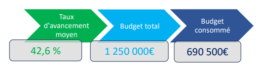

\newpage

#   Superviser et conduire les projets IT

##  Tableau de bord type de pilotage de portefeuille de projet

Le tableau de bord du portefeuille de projets offre une vision d’ensemble à un instant t de l’état des projets et de leur avancement. 
Il permet grâce aux indicateurs clés de performance de faire un diagnostic global du portefeuille afin de rendre compte de la situation, de prendre des décisions pour rectifier la gestion le cas échéant, de documenter l’évolution et de participer ainsi à l’amélioration continue dans une perspective d’optimisation du temps, des budgets et des ressources de l’entreprise.

### Les indicateurs clés de performance (KPI)

Ces indicateurs une fois prédéfinis nous permettent d’identifier les projets qui suivent les objectifs de l’entreprise, tant au niveau stratégique qu’au niveau de la rentabilité. A contrario, les projets subissant une dérive de leurs objectifs sont ainsi rapidement identifiés. 
 
Selon PRINCE2 qui est une référence dans la méthodologie de projets, l’enjeu de la mesure de performance des projets est essentiel. En effet PRINCE2 établit la liste de 6 indicateurs clés de performance à prendre en compte dans la mesure de performance des projets. 
Notre équipe PMO s’est inspirée de ces recommandations pour construire ses différents tableaux de bord. 
Sur les critères de délai, coût, effort, périmètre, qualité, risque et bénéfices, nous avons pu garder les critères de :

 -  **Délai** : mesure d’avancement dans le temps en mois,
 -  **Coût**: consommation du budget,
 -  **Effort**: ou charge mesurée en jours par homme de travail,
 -  **Risque**: évolution du risque à mesure de la progression

Les indicateurs de périmètre, bénéfices et qualité n’ont pu être apportés en raison de manque d’informations sur les projets en cours.

### Réalisation des tableaux de bord

Après avoir défini les indicateurs clés de performance, nous avons réalisé un tableau global collectant toutes les informations des projets. 
Ce tableau est une capture de l’évolution des projets au mois de juin de l’année en cours et contient les chiffres des prévisions à l’état initial, ceux au cours du mois de juin et le pourcentage de consommation sur les différents indicateurs. 
Il permet de dégager en rouge les chiffres correspondant à des projets potentiellement en dérive ou en jaune à surveiller.  
Il collecte également les différentes remarques générales de ressenti sur l’état ainsi qu’une évaluation de l’état des risques.

Ce tableau, peu lisible, nous a servi de base pour construire les différents autres tableaux généraux de restitution ainsi que les encarts de chiffres clés de présentation (voir ci-dessous).

{width=67%}

Le tableau général d’état de projet permet une plus grande lisibilité et correspond à la traduction visuelle du tableau initial des chiffres. 
Il met en avant les différents types de projet et d’une façon très visuelle, le suivi des objectifs :

Ce tableau est complété par l’histogramme de statut des projets :

{width=67%}

## Actualisation du tableau de bord de pilotage et recommandations associées bien argumentées

### Tableaux de bord des écarts par projet et tableau des écarts sur l’année

Afin d’assurer le pilotage du portefeuille de projets en tenant compte des facteurs de changements, nous avons réalisé des tableaux de synthèse ou tableaux de bord mensuels.  

Ces tableaux contiennent les indicateurs mesurables les plus significatifs :

 -  Les écarts de budget
 -  Les écarts de charge ou effort

Ainsi, par rapport aux valeurs planifiées calculées à partir des informations dont nous disposions, nous obtenons les écarts pour chaque mois d’avancement des projets. 
Ces tableaux permettent à la fois d’avoir une vision rapide sur les états des projets et leur dérive potentielle, mais également de pouvoir les compléter tous les mois très rapidement. 
Ces chiffres d’écarts en positif ou négatifs viennent alimenter automatiquement des diagrammes de courbes beaucoup plus visuels et permettant de suivre avec efficacité l’avancement des projets au cours de l’année.

Ces chiffres sont compilés indépendamment pour chaque projet afin de pouvoir réaliser des comptes rendus davantage ciblés, puis regroupés dans un tableau de bord général du portefeuille.

Pour chaque projet, nous pouvons observer en un coup d’œil et moins par mois (M0, M1…) les chiffres dépassant (en rouge) les valeurs planifiées attendues. 
Les diagrammes correspondants permettent quant à eux de constater plus clairement encore si les valeurs réelles (en foncé) dépassent les valeurs attendues (en clair) comme c’est le cas sur ce projet 1. 
Ici, les valeurs à partir de juillet sont fictives afin d’émettre une projection sur la suite du projet et extrapoler la dérive que le projet peut atteindre.

\pagebreak

{height=100%}

\pagebreak

Enfin, le tableau des écarts du portefeuille ci-dessus donne un aperçu général sur les mois écoulés des écarts positifs indiquant une dérive ou négatifs indiquant un projet conforme. 

Ici, les données sont réelles et parfois manquantes (N.C = non connu) jusqu’au mois de juin, mois des bilans à soumettre. 
Ce tableau pourra facilement être complété pour le restant de l’année et les valeurs d’écarts calculées automatiquement grâce aux fonctions de calcul Excel. 
En effet, les cellules sont remplies en allant chercher les chiffres des coûts et des charges sur les feuilles de chaque projet : 
ex de formule pour le mois de mars du projet 2 sur les écarts de coûts : =((Projet2!D7-Projet2!D8)/Projet2!D8)*100. 
Cette formule permet de calculer (la valeur réelle – la valeur planifiée)/valeur planifiée)) * 100, ce qui donne l’écart en pourcentage. 
Les courbes illustrant les écarts en positif au-dessus de l’ordonnée 0 ou négatifs en dessous et permettent d’observer immédiatement les projets les plus en marge. 
 
Les fonctionnalités de calcul des cellules Excel et la progression mensuelle de ce tableau nous permettent de générer rapidement des bilans adaptés aux évolutions de notre portefeuille de projet au fil du temps.

### Recommandations

Suite aux dernières études réalisées par *Time’s EATS*, il semble qu’il y ait une accélération de l’implantation des concurrents sur le marché national de la livraison de plats cuisinés. 
En effet, il semble que les autres entreprises de notre secteur aient prévu de livrer 80% des grandes villes de l’hexagone d’ici la fin de l’année et cela grâce à leurs plateformes digitales. 
D’autre part, il semble que les consommateurs ciblent désormais leurs commandes sur les applications en ligne à hauteur de 30% de plus ce qui conforte notre stratégie d’implantation numérique. 
 
Au vu du bilan réalisé, ce mois de juin sur l’état des projets en cours et des résultats des études de marché de l’entreprise, une mise à jour de la priorisation des projets du portefeuille nous parait essentiels. 
Outre le niveau de maitrise des risques qu’il convienne de mettre à jour lors du cycle de vie des projets, nous avons également modifié la note concernant l’avantage concurrentiel et celle de contribution à la croissance de certains projets en tenant compte de ces évolutions de marché. 

{width=67%}

####    Analyse du tableau

Le projet 1 de CRM a pris une dérive qui fait baisser son niveau de maitrise de risques. 
D’un autre côté, les projets 2 (développement d’une application mobile pour les clients) et 3 (développement d’une application pour les fournisseurs) qui sont parfaitement conformes aux attentes voient leur niveau de maitrise de risque augmenter. 
Enfin, les indicateurs de contribution à la croissance augmentent pour les projets 3 et 7 (mise à jour du site web) puisqu’ils traduisent une nouvelle tendance du marché.  

Voici les recommandations par projet que nous préconisons : 
 
Nouvelle priorisation :

 1. Projet4 : **Mise à jour réglementaire des outils de paie**
 2. Projet2 : **Développement d’une application mobile pour les clients**
 3. Projet7 : **Mise à jour du site web pour correspondre aux applications mobiles**
 4. Projet3 : **Développement d’une application mobile pour les fournisseurs**
 5. Projet1 : **Mise en place d’un outil CRM progiciel**
 6. Projet5 : **Installation d’un client de messagerie instantanée open source**

Les projets 2 (développement des applications mobiles) et 7 (mise à jour du site web) nous paraissent cruciaux pour rééquilibrer l’offre de plateformes digitales du marché. 
Certaines mesures de réajustement du périmètre concernant le projet de mise à jour du site web sont impératives afin de concentrer les premiers backlogs sur la livraison des produits.

Voici les préconisations détaillées par projet : 
 
 -  **Projet 1** : mise en place d’un outil de CRM 
ce projet connait de fortes dérives et nous proposons de le mettre en stand-by afin d’attribuer des ressources supplémentaires aux projets 2 et 7. 
Cependant, afin de profiter malgré tout d’outils statistiques, nous préconisons l’utilisation temporaire de Power BI ou d’un autre outil du marché. 
Ceci permettrait de payer uniquement des licences au personnel qualifié afin de collecter et d’étudier les chiffres relatifs aux habitudes de nos clients en vue de proposer des produits ciblés. 
 
 -  **Projet 2** : développement d’une application mobile pour les clients. 
Ce projet crucial doit maintenir son cap avec une possibilité d’ajout des ressources supplémentaires. 
Une réunion avec les parties prenantes est nécessaire afin d’avancer la livraison d’un MVP (minimum viable product) pour proposer le plus rapidement à nos clients l’utilisation des fonctionnalités principales de l’application. 
 
 -  **Projet 3** (développement d’une application mobile pour les fournisseurs) : 
le projet ne doit pas être interrompu, car il présente un fort avantage concurrentiel qui peut faire la différence. Le délai de deux mois restant nous semble tout à fait correct. 
 
 -  **Projet 4** (mise à jour réglementaire des outils de paie) : 
le caractère réglementaire de ce projet en fait une priorité, nous devons le maintenir comme prévu initialement. 
 
 -  **Projet 5** (Installation d’un client unifié de messagerie instantanée) 
comme prévu initialement, ce projet ne doit pas démarrer tant que nos objectifs stratégiques ne sont pas majoritairement atteints. 
 
 -  **Projet 6** (mise en place d’outils de cybersécurité) : 
Projet terminé 
 
 -  **Projet 7** (mise à jour du site web) : 
une réunion avec les parties prenantes est essentielle afin de revoir les priorités de ce projet essentiel à la prise de parts de marché. 
En effet, nos clients doivent pouvoir bénéficier d’ une interface ergonomique et attractive permettant de commander nos produits avec simplicité et en toute sécurité. 
Les données initialement prévues pour le CRM devront être mises en forme pour être analysées dans Power BI ou l’un des produits choisis en attendant.  
 
 
En résumé, en raison de la compétitivité croissante du marché, nous devons prendre des mesures pour ajuster notre gestion de portefeuille afin de préserver nos parts de marché existantes et en gagner de nouvelles. Afin de maintenir notre rentabilité, il est essentiel de revoir nos priorités et de réallouer nos ressources de manière appropriée. Il est particulièrement important d’accorder une attention accrue aux projets liés aux plateformes digitales, qui jouent un rôle clé dans notre stratégie globale. 
