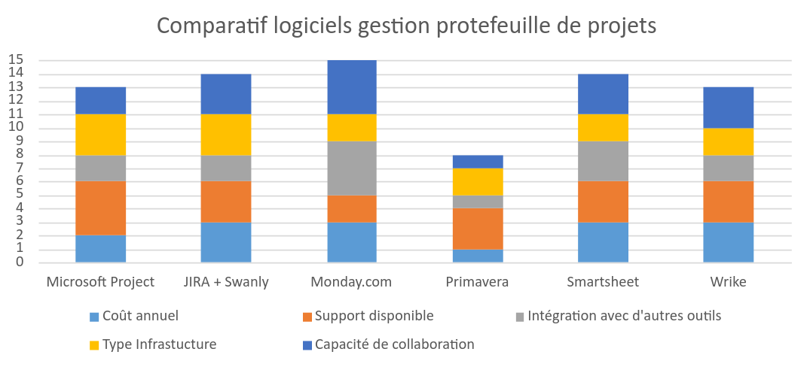
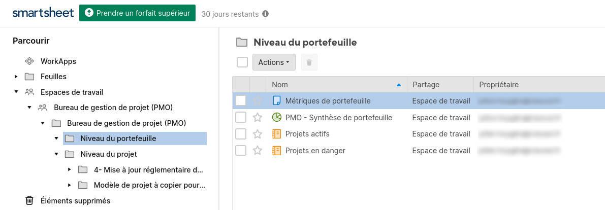
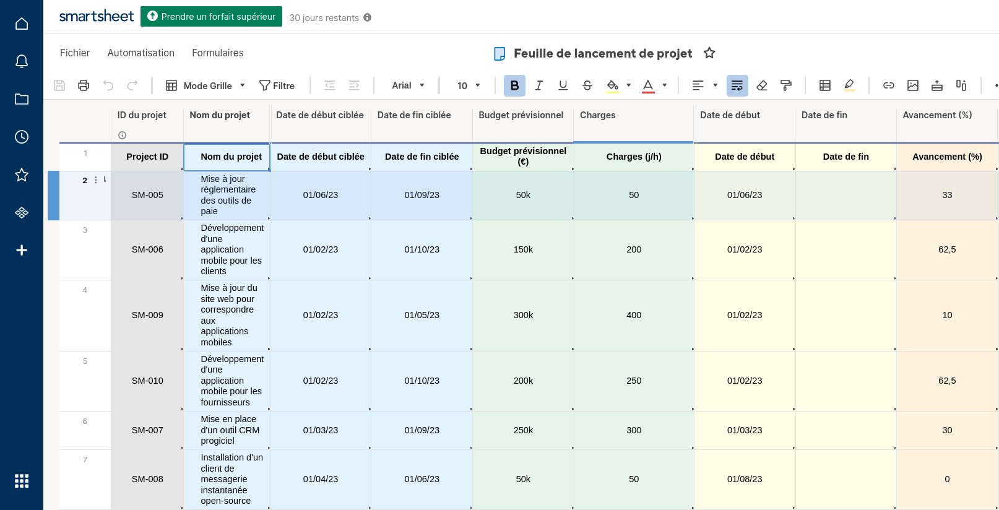
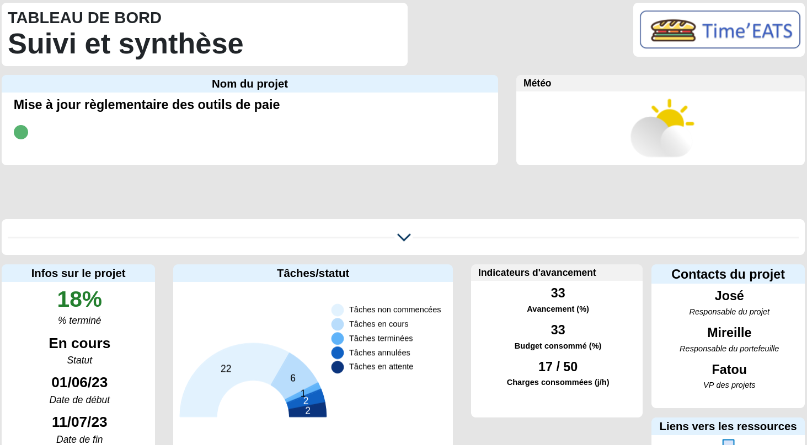
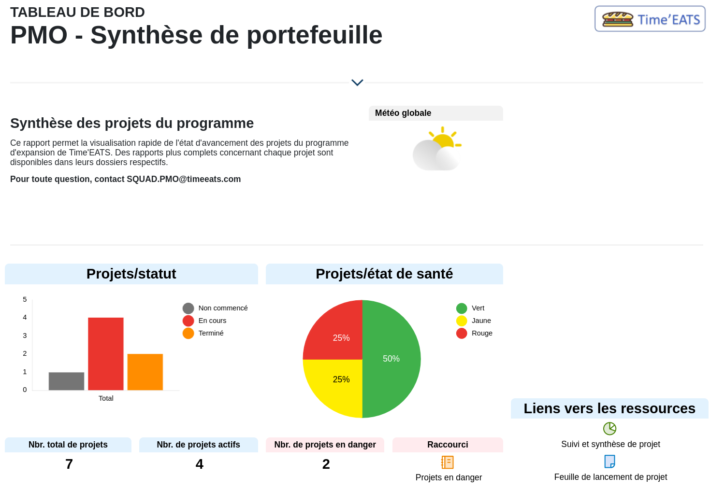
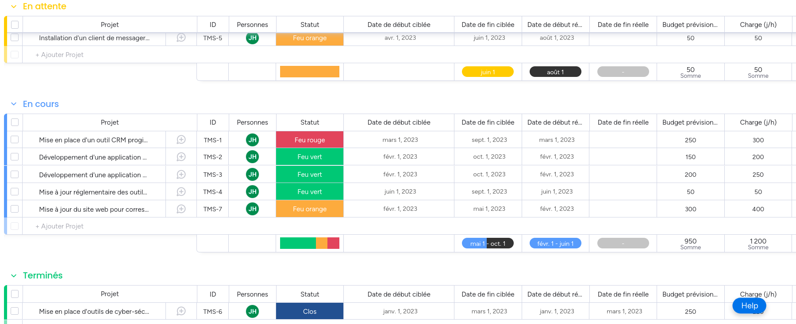
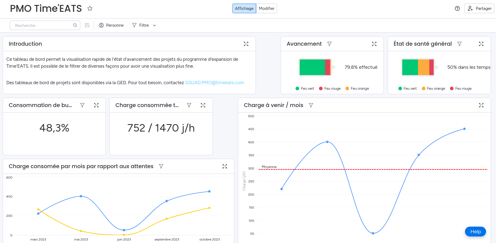

\newpage  

#   Logiciel de gestion de portefeuille

La Gestion de Portefeuille de Projets (GPP) est la supervision centralisée de plusieurs projets. Lorsque l'on gère un unique projet, on cherche à anticiper un maximum d'événements afin que le projet puisse arriver à terme dans les meilleures conditions, et qu'il réponde au besoin initial. Lorsque l'on gère plusieurs projets, on va en plus chercher à ce que les différents projets puissent évoluer dans un environnement proche sans se gêner mutuellement. C'est d'autant plus important dans le cas où des équipes sont mutualisés sur plusieurs projets, la GPP permettant d'avoir une vue d'ensemble et ainsi mieux se coordonner pour que tous les projets arrivent à terme dans les meilleures conditions.  

Comme pour la gestion de projet, il existe des outils de gestion de portefeuille de projets (parfois des mêmes éditeurs) proposant un ensemble d'outils dédiés qui permettent une gestion efficace. Par la suite, nous allons analyser quelques solutions, avant de les évaluer. Nous réaliserons ensuite des tableaux de bord sommaires des deux meilleures solutions, pour découvrir les possibilités et les limites de chaque solution.

##  Benchmark de logiciels de GPP

Parmi les solutions de type *PPM* [^6] que nous avons choisi d'étudier, nous avons retenu les suivantes, sur des critères de coûts annuels, de support disponible, d'intégration avec des outils tiers, d'infrastructure, et de possibilités de collaboration. Les évaluations sont faites pour une équipe de vingt-cinq personnes.

 -  **Microsoft Project**
 -  **JIRA** avec une extension nommée **Swanly**
 -  **Monday.com**
 -  **Oracle Primavera (P6)**
 -  **Smartsheet**
 -  **Wrike**

\pagebreak

| Solution          	| Coûts 	| Support 	| Intégration 	| Infrastructure 	| Collaboration 	| **Total** 	|
|-------------------	|:-----:	|:-------:	|:-----------:	|:--------------:	|:-------------:	|:---------:	|
| Microsoft Project 	| 2     	| 4       	| 2           	| 3              	| 2             	| **21**    	|
| JIRA + Swanly     	| 3     	| 3       	| 2           	| 3              	| 3             	| **25**    	|
| Monday.com        	| 3     	| 2       	| 4           	| 2              	| 4             	| **27**    	|
| Oracle Primavera  	| 1     	| 3       	| 1           	| 2              	| 1             	| **12**    	|
| Smartsheet        	| 3     	| 3       	| 3           	| 2              	| 3             	| **27**    	|
| Wrike             	| 3     	| 3       	| 2           	| 2              	| 3             	| **26**    	|
|                   	|       	|         	|             	|                	|               	|           	|
| Poids             	| 3     	| 1       	| 2           	| 1              	| 2             	|           	|
Table: Évaluation de logiciels de gestion de portefeuille de projets

Pour chaque combinaison de solution et critère, nous avons évalué entre 1 et 4 [^7]. Nous avons également utilisé des poids. Ces poids permettent de contextualiser cette analyse avec les besoins et l'organisation de *Time'EATS*. Ceux-ci ont été définis à partir du contexte donné, et en fonction de la direction voulue par la direction. Enfin, le total est la somme des produits des évaluations avec leurs poids, tel que $T=\sum_{i=1}^{5} n_i \cdot p_i$; avec $n$ la note, $p$ le poids, et $i$ le numéro de colonne.

Nous retrouvons ainsi :

 -  **Microsoft Project** : *Microsoft Project (Plan 3)* est un logiciel très complet. Il permet à la fois de faire la gestion de projet de façon prédictive et itérative, que de la gestion de portefeuille de projets. Il propose beaucoup de fonctionnalités, beaucoup de documentation, mais également un coût qui reste relativement élevé, de l'ordre de 700€/mois ou 41500€ en paiement unique. De plus, il n'offre pas la possibilité de travailler de façon collaborative sur les projets, ni une très bonne intégration avec d'autres outils tiers.
 -  **JIRA** avec une extension nommée **Swanly** : *JIRA* est très populaire, notamment pour les entreprises ayant des équipes utilisant une méthode itérative comme *Scrum*. Une extension nommé *Swanly*, permet de faire de la gestion de portefeuille de projet et s'avère particulièrement adaptée pour les projets de développement informatique notamment avec un système de suivi des problèmes. La collaboration est comme *JIRA*, très bonne, même si la modification simultanée n'est pas possible à l'heure actuelle. En terme de tarif, *JIRA* coûte 380€/mois en version cloud, ou 40k€/an en version on-premise. Il faut compter le prix de *Swanly*, qui est de 750€/an.
 -  **Monday.com** : Basé uniquement dans le cloud, *Monday.com* à l'avantage de proposer des modèles de tableaux de bord clé en main. On retrouve une multitude d'outils intégrés permettant de l'intégrer très facilement dans les processus existants. La force de Monday.com est sa capacité de collaboration, où tout est réalisé en temps réel pour différents utilisateurs. Disponible pour 400€/mois, ça reste une solution efficace malgré des fonctionnalités manquantes par rapport à d'autres solutions.
 -  **Oracle Primavera (P6 Pro.)** : Primavera est une solution locale uniquement surtout utilisé dans les grandes entreprises. Elle reste très efficace, notamment en terme d'estimation ou de visualisation de données, mais ne dispose d'aucune possibilité de collaboration. De plus, les licences sont onéreuses, de l'ordre de 4000€, plus les formations nécessaires à l'utilisation de l'outil.
 -  **Smartsheet** : Solution encore jeune mais utilisé par des moyennes et grandes entreprises, Smartsheet propose des fonctionnalités de collaboration comme de la planification interactive, des systèmes de suivi et d'automatisation. Solution peu onéreuse, environ 550€/mois, qui de plus s'intègre facilement avec des outils et processus existants.
 -  **Wrike** : Comme Smartsheet, Wrike est une solution encore jeune, mais qui dispose de fonctionnalités avancées de collaboration. Elle est particulièrement adaptée à des développements informatiques, en proposant une intégration avec des logiciels de *SCM*[^8] comme *GitHub*. Celle-ci reste un peu plus onéreuse, à environ 620€/mois.

###  Choix de la solution

Dans un soucis de clarté, nous avons produit un histogramme afin de visualiser les données du tableau ci-dessus.

{width=80%}

Les deux solutions qui ont des scores les plus élevés sont *Smartsheet* (27) et *Monday.com* (27). Elles disposent en effet de fonctionnalités qui sont adaptés aux besoins de développement de *Time'EATS*, tout en ayant des coûts contrôlés, et une liberté d'utilisation pour avoir des processus adaptés à nos besoins. Par la suite, nous allons construire un tableau de bord sur chacune des solutions, pour ensuite en faire un comparatif argumenté.

##  Réalisation de tableaux de bord de GPP

### Smartsheet

*Smartsheet* fonctionne à l'instar d'une petite *GED*, dont on retrouve des tableurs qui font des références entre eux.

{width=50%}

 >  À noter qu'il n'est pas possible d'ajouter des documents en tant que tels. Cela ne peut pas servir de serveur de stockage.

Dès lors, on a la possibilité de remplir divers fichiers avec des détails concernant les projets menés. Le tout est totalement personnalisable à l'instar d'un fichier *Excel*, il est également possible de créer des processus automatisés. Dans notre cas, nous avons par exemple rempli un tableau de synthèse des différents projets, sur lequel le tableau de bord sera en partie basé.

{width=67%}

Comme annoncé, Spreadsheet propose un équivalent de petite GED. Il est ainsi possible de créer des classeurs et rapports pour des portefeuilles de projets, mais également pour des projets. On imagine que cela peut être très utile dans le cas où l'on voudrait centraliser les projets, et le portefeuille de projets. Nous nous sommes ainsi basé sur un modèle existant que nous avons modifié pour refleter l'un des projets de *Time'EATS*, qui est la mise à jour réglementaire des outils de paie.
Comme pour d'autres solutions, on retrouve ainsi deux documents distincts ; un classeur contenant les données, que l'on peut utiliser des formules pour calculer, catégoriser, trier, découper, etc., et le rapport en lui-même. À l'aide de widgets, qui nous proposent des visualisations comme des statistiques, des diagrammes ou encore des ressources à partir du tableur, permettent de personnaliser les rapports pour qu'ils reflètent nos besoins.

{width=67%}

De la même façon, on utilise les mêmes procédés pour créer un rapport pour le portefeuille de projets. Cette fois-ci, on peut en plus se baser sur d'autres rapports de projets existants.

{width=67%}

Cependant, on se retrouve vite limité. Dans le cas où l'on utiliserait d'autres solutions pour stocker et traiter ses données, on se retrouve à avoir des doublons entre plusieurs solutions, ce qui peut être source d'erreur. De plus, on est assez vite limité sur la personnalisation des rapports. Par exemple, il n'existe pas de système de suivi des problèmes ou des tâches, il faut les créer manuellement sans pouvoir les automatiser. Enfin, les capacités de collaboration sont limitées à du travail dans le cloud. Imaginons que deux personnes travaillent sur le même fichier en même temps. La deuxième personne ayant enregistré le fichier, écrasera les modifications de la première personne sans possibilité pour elle de retrouver ses modifications. Il est donc nécessaire de garder cette limitation en tête, ou de s'organiser pour que cela n'arrive pas.

### Monday.com

*Monday.com* fonctionne de la même façon que *Smartsheet* : on utilise un ou plusieurs tableurs qui nous servent à entreposer et traiter nos données, puis on a la possibilité de créer des rapports pour les afficher. On note deux différences majeures : 

 -  Il est possible de "marquer" les colonnes d'un tableau avec un type de données, ce qui permettra de créer des diagrammes très facilement.
 -  Toutes les modifications sont interactives entre utilisateurs, et il existe plusieurs outils pour qu'ils puissent à la fois communiquer, mais aussi s'organiser dans leurs activitées.

{width=80%}

On peut même imaginer plus loin, en créant un tableau par projet, chaque tableau contenant les phases, tâches et ressources d'un projet. En indiquant (et marquant) des champs avec des dates, on dispose à la fois d'un échéancier, d'un Kanban ou encore d'un diagramme de *Gantt*, qui sont générés automatiquement, et s'auto-maintiennent au fur-et-à-mesure du projet dans son cycle de vie. Pour des questions de simplicité, on a toutefois utilisé qu'un seul tableau pour indiquer l'ensemble de nos projets du programme.  

Avec toutes ces données, on a la possibilité de créer un tableau de bord. Cette fois-ci, on dispose de beaucoup d'éléments qui sont très personnalisables, ainsi que des intégrations avec des logiciels tiers. Avec des options de tri et de filtrage, on ajoute de l'interactivité à nos données.

{width=80%}

Ce qui est particulièrement appréciable, est l'ergonomie de cette solution. Avec le même tableau de bord, on peut tout à fait imaginer pouvoir traiter à la fois un projet unique comme un ensemble de projets liés autour d'un sujet. *Monday.com* reste une solution très complexe avec beaucoup de fonctionnalités, mais son usage est intuitif et permet de gagner en efficacité, transparence et communication dans le travail.

[^6]: *PPM* - *Portfolio Project Management*
[^7]: 1 - Pas bon / inexistant; 4 - Très bon
[^8]: *SCM* - *Source Control Management*