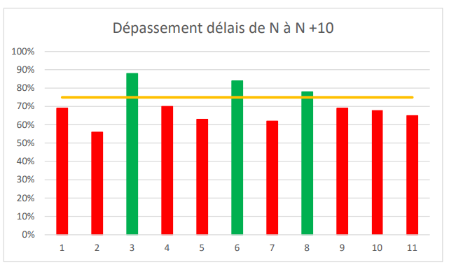

\newpage  

#   Clore les projets et capitaliser l'expérience

##  Mise en place d'un outil de gestion de tests

Un outil de gestion des tests est une application logicielle spécialement conçue pour aider les équipes de développement et de test à organiser, planifier, exécuter et suivre les activités liées aux tests logiciels. Ces outils offrent une gamme de fonctionnalités pour faciliter la gestion efficace des tests, améliorer la collaboration entre les membres de l'équipe et garantir la qualité du logiciel. 

Les outils de gestion des tests permettent aux équipes de créer et de gérer des cas de test, de les organiser en suites de test, et de définir les exigences et les critères d'acceptation. Ils facilitent la planification et l'exécution des cycles de test en permettant de définir des étapes, des itérations et des dépendances entre les tests. Les résultats des tests sont enregistrés et suivis pour évaluer la couverture des tests, détecter les anomalies et générer des rapports sur l'avancement des tests. 

Ces outils permettent également de gérer les défauts détectés lors des tests en offrant des fonctionnalités de suivi des bogues, de collaboration entre les membres de l'équipe et de gestion du cycle de vie des défauts. Ils facilitent la communication entre les développeurs, les testeurs et les parties prenantes, en permettant de documenter les commentaires, les captures d'écran et les informations supplémentaires liées aux problèmes détectés. 

Les fonctionnalités avancées des outils de gestion des tests incluent souvent des tableaux de bord personnalisables, des analyses de tendances, des intégrations avec d'autres outils de développement et des options de reporting pour fournir une visibilité complète sur la qualité du logiciel. Certains outils offrent également une prise en charge des tests automatisés, permettant d'automatiser l'exécution des tests et de générer des rapports sur les résultats. 

En résumé, un outil de gestion des tests est un composant essentiel de l'écosystème de développement logiciel qui facilite la planification, l'exécution, le suivi et l'amélioration continue des activités de test. Il permet aux équipes de travailler de manière plus structurée, d'assurer la qualité du logiciel et d'optimiser les processus de test tout au long du cycle de vie du projet.

 -  JIRA : JIRA est un outil de gestion de projet populaire qui offre également des fonctionnalités de gestion des tests. Il permet de créer et de suivre des cas de test, de gérer les cycles de test et de générer des rapports sur l'avancement des tests.
 -  Azure Dev Ops : Azure Dev Ops est un outil de gestion de projet qui intègre également des fonctionnalité de gestion de tests. Il permet de créer et de suivre des cas de test, de gérer les cycles de test et de générer des rapports sur l'avancement des tests.
 -  qTest : qTest est une plateforme de gestion des tests qui permet de planifier, suivre et exécuter les tests. Il offre des fonctionnalités de gestion des cas de test, de suivi des bogues, de génération de rapports et d'intégration avec d'autres outils de développement.

| Critère                                           	| JIRA                            	| Azure Dev Ops                       	| qTest                               	|
|---------------------------------------------------	|---------------------------------	|-------------------------------------	|-------------------------------------	|
| Création de cas tests                             	| Oui                             	| Oui                                 	| Oui                                 	|
| Gestion des cycles de test                        	| Via tableau                     	| Oui                                 	| Oui                                 	|
| Exécution des tests                               	| Manuelle                        	| Automatique (selon le type de test) 	| Automatique (selon le type de test) 	|
| Rapport sur les tests                             	| Rapport graphique               	| Rapport graphique                   	| Rapport graphique                   	|
|  Présence d'un contrôle de version du code source 	| Non                             	| Oui                                 	| Non                                 	|
| Prix                                              	| ~790€ / an pour 1-10 utilisateurs 	| ~100€ / utilisateur / an            	| ~1250€ / utilisateur / an           	|
Table: Benchmark de différents outils de gestion de tests

Au vu des fonctionnalité proposé par chaque logiciel. Je propose de partir sur Azure Dev Ops qui nous permet en plus d’avoir un contrôle de version. 

\pagebreak

##  Modèle de procès verbal de recette 

\pagebreak

##  Capitalisation de l'expérience

En tant que PMO cherchant à améliorer continuellement la gestion du portefeuille, voici les actions immédiates à entreprendre concernant le référentiel documentaire incomplet :  

Effectuer une évaluation approfondie du référentiel documentaire pour identifier les documents manquants qui nécessitent une attention immédiate. Cela peut impliquer des recherches internes comme des demandes de listing de documents dont les parties prenantes (les chefs de projet et les équipes opérationnelles) ont fréquemment besoin.  
 
Intégrer les documents manquants dans le référentiel documentaire existant, en veillant à ce qu'ils soient correctement organisés, classés et accessibles à tous les acteurs concernés. Mettre également à jour les documents existants, le cas échéant, pour refléter les changements récents.  

Pour systématiser et garantir une révision régulière du référentiel documentaire, voici quelques dispositifs à mettre en place : 

Assigner un responsable spécifique au sein de la PMO chargé de superviser et de gérer le référentiel documentaire. Ce responsable devrait avoir une compréhension approfondie des exigences en matière de documentation et de gestion du portefeuille. 

Établir un processus clair et structuré pour la révision régulière du référentiel documentaire, en spécifiant les étapes, les échéances et les responsabilités. Cela peut inclure des revues trimestrielles, semestrielles ou annuelles pour s'assurer que les documents sont à jour. 

Définir une liste des documents critiques et essentiels pour la gestion du portefeuille, tels que les modèles de procès-verbaux, les rapports d'avancement, les indicateurs de performance, etc. Ces documents doivent être priorisés lors des révisions régulières. 

Utiliser des outils de gestion documentaire appropriés pour faciliter le stockage, la recherche et la récupération des documents. Ces outils peuvent inclure des systèmes de gestion électronique de documents (GED) ou des plateformes (cf benchmark outil de Gestion Electronique de Documents). 

Fournir des formations régulières aux membres de l'équipe de la PMO et aux parties prenantes concernées sur les meilleures pratiques en matière de gestion documentaire, l'importance de la mise à jour régulière et les avantages d'un référentiel documentaire complet et précis. 

En mettant en place ces dispositifs, la gestion du portefeuille bénéficiera d'une approche systématique pour la révision régulière du référentiel documentaire, permettant d'améliorer la traçabilité, la cohérence et la qualité des informations documentées.

### Respect des délais

En fin d’année N, la cellule PMO mesure que les projets menés ont été terminés dans les temps à 69 %.  

La direction souhaite que cet indicateur soit mesuré durablement afin de déterminer si les actions menées ont un impact concret et positionne pour l’année N+1 un objectif à 75 %. 
 
Nous avons ainsi réalisé une représentation graphique fictive de l’évolution du respect des délais du portefeuille sur plusieurs années. 
 
D’abord en collectant les données dans le tableau ci-dessous :

| Année 	| Délai 	| Objectifs 	|
|-------	|-------	|-----------	|
| 2023  	| 69%   	| 75%       	|
| 2024  	| 56%   	| 75%       	|
| 2025  	| 88%   	| 75%       	|
| 2026  	| 70%   	| 75%       	|
| 2027  	| 63%   	| 75%       	|
| 2028  	| 84%   	| 75%       	|
| 2029  	| 62%   	| 75%       	|
| 2030  	| 78%   	| 75%       	|
| 2031  	| 69%   	| 75%       	|
| 2032  	| 68%   	| 75%       	|
| 2033  	| 65%   	| 75%       	|
Table: Chiffres de respect des délais

Puis en convertissant ces valeurs en histogramme et en affichant l’objectif de 75% en ligne horizontale grâce aux options de graphiques combinés d’Excel. 

{width=80%}

La limite d'un tel indicateur est qu'il ne fournit qu'une mesure globale du respect des délais et ne permet pas d'identifier les raisons spécifiques des retards. Il est important de compléter cet indicateur par d'autres métriques et analyses pour comprendre en détail les facteurs qui contribuent aux retards et prendre des mesures correctives appropriées. 